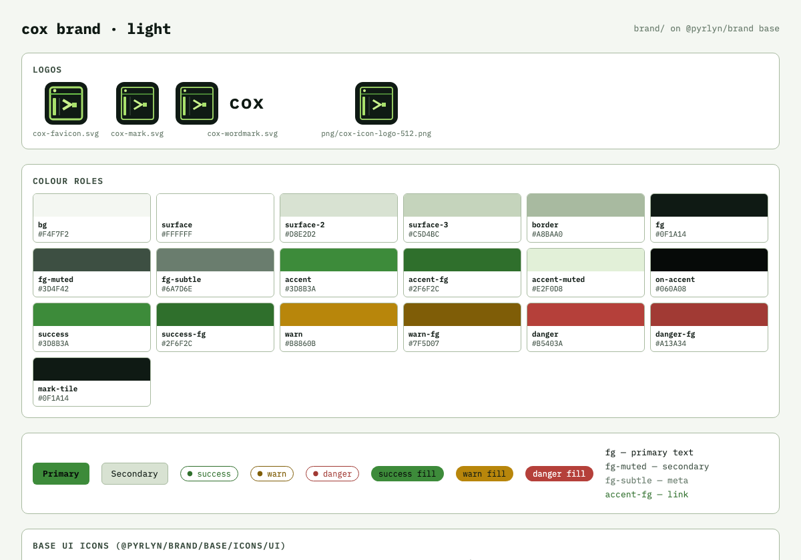
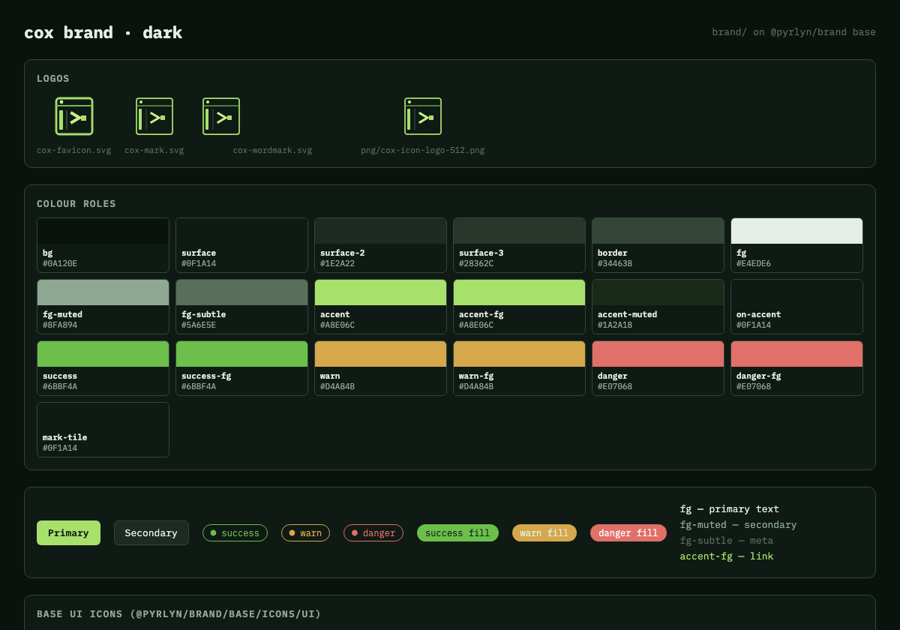

# cox brand

This folder is the **source of truth for the cox brand**: logos, colour tokens and the brandbook (`DESIGN.md`) of the cox site and docs. It holds only what is
specific to cox. Everything the Pyrlyn products share (type scale, spacing, radii, sizes,
breakpoints, motion, the semantic colour roles, IBM Plex Mono, the UI icons and the `.pyr-*`
components) is the **Pyrlyn base layer** in [pyrlyn/brand](https://github.com/pyrlyn/brand) `base/`,
and this pack inherits it instead of copying it.

## Inheritance: base from pyrlyn/brand, cox deltas here

| Layer | Lives in | Provides |
|---|---|---|
| Base | [pyrlyn/brand `base/`](https://github.com/pyrlyn/brand/tree/v0.3.0/base), installed as `@pyrlyn/brand` | tokens (`--pyr-*` scales), the list of colour roles and their fallbacks, fonts, UI icons, components |
| cox | this folder | the colour roles per theme (`--pyr-bg`, `--pyr-accent` …), cox's own tokens (`--cox-*`), logos |

- `package.json` pins the base: `"@pyrlyn/brand": "github:pyrlyn/brand#v0.3.0"`;
  `package-lock.json` locks it to commit `b42ec5b`.
- `tokens.json` has `"$extends": "@pyrlyn/brand/base/tokens.json"` and only sets cox's values.
- `node build.mjs` merges the two and writes `dist/tokens.css`, which starts with
  `@import "@pyrlyn/brand/base/tokens.css";` and then sets the roles, plus `dist/tokens.resolved.json`.
- No base file or value is copied into this folder. Roles cox leaves empty use the base fallback
  (listed in the table below).

**Where to change what.** cox colours, logos and `DESIGN.md`: here, in a cox PR.
Shared tokens, fonts, UI icons, components or the role list: in pyrlyn/brand `base/` first, then bump the
tag in `package.json`, run `npm install` and `node build.mjs` here.

**Origin.** Imported from pyrlyn/brand v0.3.0 `brands/cox/`. The pack now lives in this repo;
pyrlyn/brand drops `brands/*` in its next release and keeps `base/` unchanged, so the v0.3.0 pin stays
valid until a newer base is needed.

## Use

```sh
cd brand && npm ci          # installs the pinned @pyrlyn/brand into brand/node_modules
npm run build               # regenerate dist/ and the token table below
npm run check               # CI-style check: exit 1 if dist/ or the table is stale
```

In a bundler (Vite, PostCSS, Tailwind v4, esbuild) import the cox tokens, then the base fonts and,
if wanted, the base components; the bare `@pyrlyn/brand/…` specifiers resolve through
`brand/node_modules`:

```css
@import "<path to>/brand/dist/tokens.css";   /* base tokens + cox roles (--pyr-*) + --cox-* */
@import "@pyrlyn/brand/base/fonts.css";      /* IBM Plex Mono */
@import "@pyrlyn/brand/base/components.css"; /* .pyr-btn, .pyr-chip … in cox colours */
```

Plain HTML has no module resolution: link `brand/node_modules/@pyrlyn/brand/dist/base/tokens.css`
before `brand/dist/tokens.css`. UI icons: `@pyrlyn/brand/base/icons/ui/*.svg` (cox has no icons of its own).

Light ("paper terminal") is cox's default theme; dark ("green on ink") is first-class.


## Layout

```text
brand/
  package.json, package-lock.json  pins @pyrlyn/brand (base) to v0.3.0
  tokens.json      cox roles + --cox-* extras, extends @pyrlyn/brand/base/tokens.json
  build.mjs        -> dist/tokens.css, dist/tokens.resolved.json, the table below
  DESIGN.md        cox brandbook (deltas only)
  logo/ (+png/)    mark, wordmark, favicon; PNG exports
  preview/         light/dark preview PNGs
```

## Tokens

<!-- BEGIN TOKEN TABLE (generated by build.mjs, do not edit) -->
Base: `@pyrlyn/brand` 0.3.0 (`github:pyrlyn/brand#v0.3.0`). AA = lowest contrast of a text role on `bg`, `surface` and
`surface-2` (`on-accent`: on `accent`); ✓ ≥ 4.5:1. Roles without a value use the base fallback shown.

Brand constants: `--cox-brand-forest` `#0F1A14` · `--cox-brand-chartreuse` `#A8E06C` · `--cox-brand-terminal-green` `#C8F08A`

| Role | CSS variable | light (default) | light AA | dark | dark AA |
|---|---|---|---|---|---|
| `bg` | `--pyr-bg` | `#F4F7F2` |  | `#0A120E` |  |
| `surface` | `--pyr-surface` | `#FFFFFF` |  | `#0F1A14` |  |
| `surface-2` | `--pyr-surface-2` | `#D8E2D2` |  | `#1E2A22` |  |
| `border` | `--pyr-border` | `#A8BAA0` |  | `#344638` |  |
| `fg` | `--pyr-fg` | `#0F1A14` | 13.35 ✓ | `#E4EDE6` | 12.45 ✓ |
| `fg-muted` | `--pyr-fg-muted` | `#3D4F42` | 6.57 ✓ | `#8FA894` | 5.82 ✓ |
| `fg-subtle` | `--pyr-fg-subtle` | `#6A7D6E` | 3.30 ✗ (large text only) | `#5A6E5E` | 2.71 ✗ |
| `accent` | `--pyr-accent` | `#3D8B3A` |  | `#A8E06C` |  |
| `accent-muted` | `--pyr-accent-muted` | `#E2F0D8` |  | `#1A2A18` |  |
| `mark-tile` | `--pyr-mark-tile` | `#0F1A14` |  | `#0F1A14` |  |
| `surface-3` | `--pyr-surface-3` | `#C5D4BC` |  | `#28362C` |  |
| `accent-fg` | `--pyr-accent-fg` | `#2F6F2C` | 4.58 ✓ | `#A8E06C` | 9.61 ✓ |
| `on-accent` | `--pyr-on-accent` | `#060A08` | 4.70 ✓ | `#0F1A14` | 11.50 ✓ |
| `delta-fg` | `--pyr-delta-fg` | `#3D8B3A (base fallback)` | 3.18 ✗ (large text only) | `#A8E06C (base fallback)` | 9.61 ✓ |
| `danger` | `--pyr-danger` | `#B5403A` |  | `#E07068` |  |
| `danger-fg` | `--pyr-danger-fg` | `#A13A34` | 4.96 ✓ | `#E07068` | 4.74 ✓ |
| `success` | `--pyr-success` | `#3D8B3A` |  | `#6BBF4A` |  |
| `success-fg` | `--pyr-success-fg` | `#2F6F2C` | 4.58 ✓ | `#6BBF4A` | 6.51 ✓ |
| `warn` | `--pyr-warn` | `#B8860B` |  | `#D4A84B` |  |
| `warn-fg` | `--pyr-warn-fg` | `#7F5D07` | 4.53 ✓ | `#D4A84B` | 6.74 ✓ |
| `shadow-e1` | `--pyr-shadow-e1` | `0 1px 2px rgba(15, 26, 20, 0.06), 0 4px 12px rgba(15, 26, 20, 0.04)` |  | `0 1px 2px rgba(0, 0, 0, 0.35), 0 4px 16px rgba(0, 0, 0, 0.28)` |  |
| cox extra | `--cox-surface-1` | `#E8EEE4` | | `#162018` | |
| cox extra | `--cox-border-hairline` | `#D0DBC8` | | `#1C2820` | |
| cox extra | `--cox-accent-hover` | `#2F6F2C` | | `#C8F08A` | |
| cox extra | `--cox-accent-leaf` | `#6BBF4A` | | `#6BBF4A` | |
| cox extra | `--cox-chartreuse` | `#A8E06C` | | `#C8F08A` | |
| cox extra | `--cox-info` | `#2F6B5A` | | `#5AABB0` | |
| cox extra | `--cox-code-bg` | `#0F1A14` | | `#060A08` | |
| cox extra | `--cox-code-fg` | `#C8F08A` | | `#C8F08A` | |
| cox extra | `--cox-glass-fill` | `rgba(255, 255, 255, 0.72)` | | `rgba(15, 26, 20, 0.72)` | |
| cox extra | `--cox-glass-border` | `rgba(208, 219, 200, 0.9)` | | `rgba(28, 40, 32, 0.9)` | |
| cox extra | `--cox-accent-glow` | `0 0 0 3px var(--pyr-accent-muted), 0 0 18px rgba(61, 139, 58, 0.22)` | | `0 0 0 3px var(--pyr-accent-muted), 0 0 20px rgba(168, 224, 108, 0.28)` | |
<!-- END TOKEN TABLE -->

## Changes since pyrlyn/brand v0.3.0 `brands/cox`

- `tokens.json` extends `@pyrlyn/brand/base/tokens.json` (was `../../base/tokens.json`).
- **`on-accent` added** (cox had none, so the base fell back to `bg`): `#060A08` on light (4.70:1 on the
  `#3D8B3A` accent; white is only 4.24:1 and forest `#0F1A14` 4.20:1), forest `#0F1A14` on dark (11.50:1).
- **`accent-fg` added**: `#2F6F2C` on light (cox's `accent-hover`), because the accent as link text is
  3.92:1 on `bg`; chartreuse on dark.
- **`success-fg`, `warn-fg`, `danger-fg` added**: the light status fills are below 4.5:1 as text on
  `surface-2` (`#B8860B` 2.44:1), so text gets darkened variants (`#2F6F2C`, `#7F5D07`, `#A13A34`);
  dark keeps the fills, which already pass.
- New `package.json` / `package-lock.json` (base pin), `build.mjs` and `dist/` (the build moved here from
  pyrlyn/brand; before these additions the output was identical to v0.3.0 `dist/brands/cox/`).
- `DESIGN.md`: base links point at pyrlyn/brand v0.3.0; the new roles are documented.

## Checked against the product

- `logo/cox-mark.svg`, `cox-wordmark.svg`, `cox-favicon.svg` are byte-identical to `docs/brand/logo.svg`,
  `logo-wordmark.svg`, `favicon.svg` (and `website/static/images/cox-mark.svg`, `favicon.svg`);
  `png/cox-icon-logo-512-landing-v1.png` and `png/cox-icon-favicon-256.png` = `docs/assets/landing-v1/`.
- The colour roles were taken from `docs/brand/tokens.css` at `03825e72`, which is still current `main`.

## Known gaps

- `fg-subtle` fails AA as body text (light 4.07:1 on `bg`, 3.30:1 on `surface-2`; dark 3.46:1 on `bg`,
  2.71:1 on `surface-2`): it is cox's own tertiary-text value and was left unchanged; use it only for
  large or non-essential text, or raise it in a follow-up.
- cox has no `delta` role (an rtok idea); its `delta-fg` falls back to the accent, which is 3.18:1 as
  text on light. Use `accent-fg` for text.
- On light, `accent-hover` (`#2F6F2C`) is darker than the accent, so a dark `on-accent` label drops to
  3.25:1 on hover; lighten on hover (e.g. `--cox-accent-leaf`) or keep hover labels large.
- The desktop app keeps its own token system (`desktop/design/tokens/`, white on-accent on its own fills).
- Nothing in cox imports this folder yet; the site and docs still use `docs/brand/tokens.css`.

## Preview

| Light | Dark |
|---|---|
|  |  |
